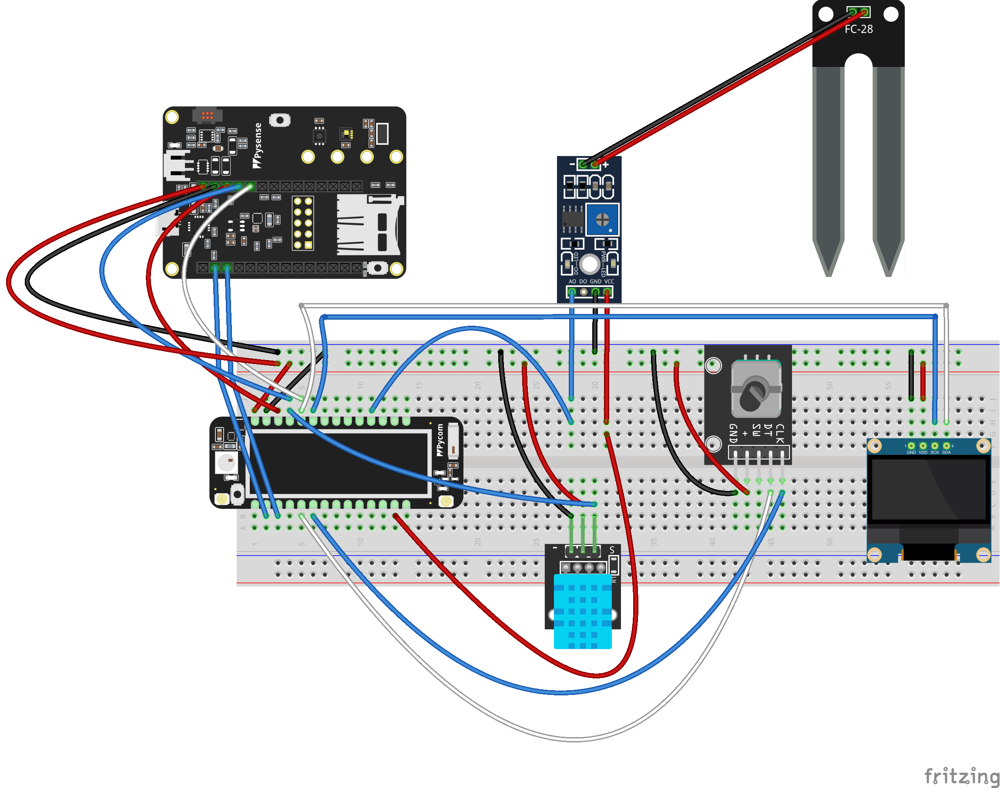
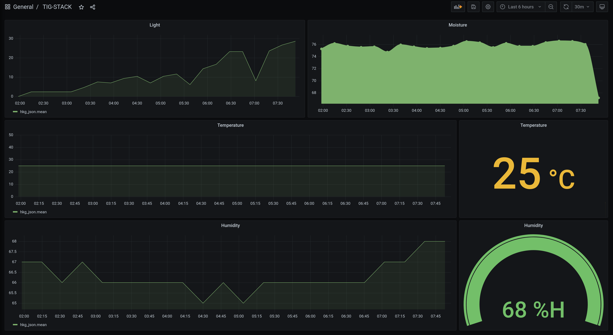
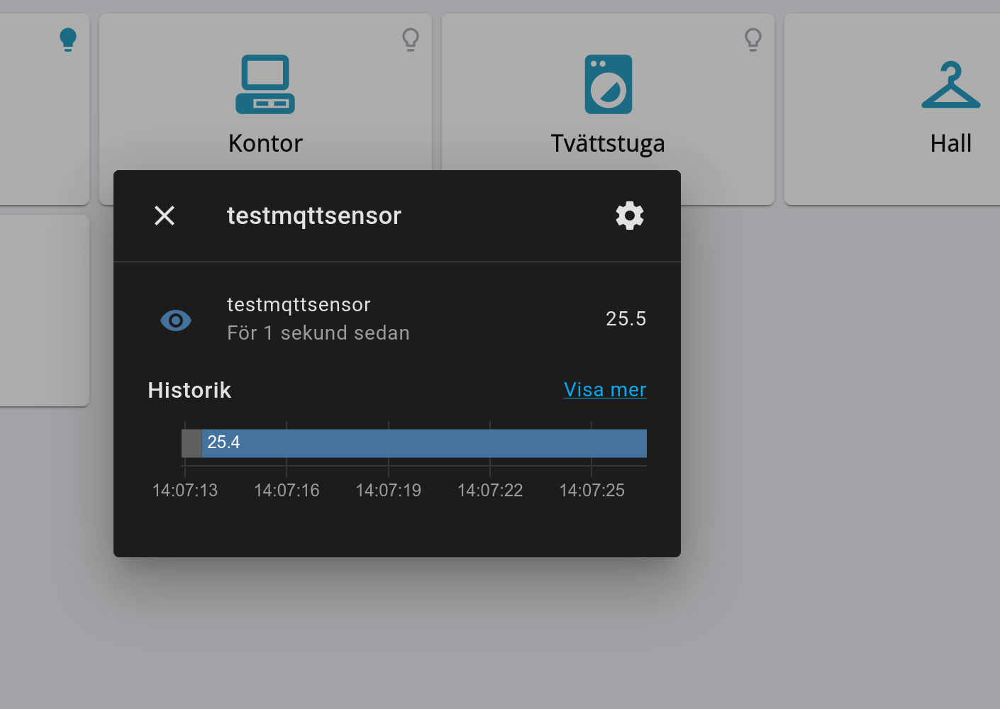
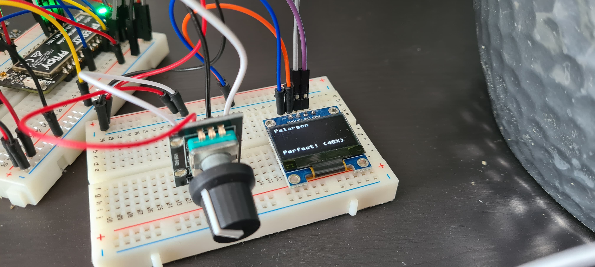
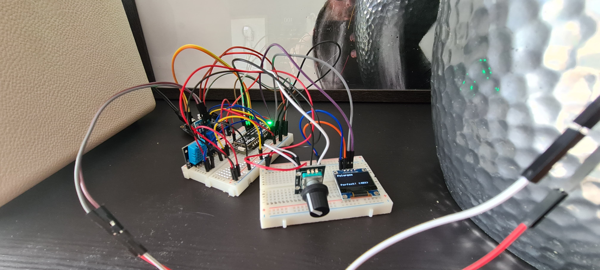

# IoT Plants - Choose the type of plant and monitor it with the TIG-stack (While proving a point to your wife).
*By: Olle Rönnberg, orovm09*
# Table of contents
<!-- vim-markdown-toc Marked -->

* [Introduction](#introduction)
* [Project overview](#project-overview)
* [Material](#material)
                * [Main components](#main-components)
                * [Sensors](#sensors)
* [Computer setup](#computer-setup)
* [Putting everything toghether](#putting-everything-toghether)
* [Platform](#platform)
            * [MQTT](#mqtt)
            * [Telegraf](#telegraf)
            * [InfluxDB](#influxdb)
            * [Grafana](#grafana)
* [The code](#the-code)
            * [Code for WiFi connectivity](#code-for-wifi-connectivity)
            * [Code for the actual application](#code-for-the-actual-application)
            * [Key functions](#key-functions)
* [Transmitting the data / connectivity](#transmitting-the-data-/-connectivity)
            * [MQTT](#mqtt)
* [Presenting the data](#presenting-the-data)
* [Finalizing the design](#finalizing-the-design)

<!-- vim-markdown-toc -->

# Introduction
Taking care of plants (watering them, making sure they get enough light and placing
them in the right environment) can be difficult for a novice like me. Fortunately for me I have a wife that knows how to do this. However, after a calm (well...) discussion we agreed to disagree that an IoT system that tells you when to water the plants while also giving you precise data about the plants environment is going to make the plants thrive better than "using a lifetime of experience".

This tutorial shows my attempt to prove her wrong.


# Project overview
With the help of a FiPy microcontroller, a PySense expansionboard, a display, a
rotary encoder, and sensors we will create a system that monitors the environment
with MQTT and the TIG-stack. We will measure the moisture of the soil,
temperature, humidity and the amount of light the plant gets. We will collect this data and
present it in a fancy and cool dashboard using Grafana (the "G" in
"TIG-stack"). All this data will be handled locally using my self-hosted server. If you dont have a server of your own, you can easily follow this tutorial using a Raspberry Pi or another microcontroller, or you can use a cloud service. We will also use a display and a rotary encoder so that we can select what type of plant we are monitoring (with each plant having their own min and max moist values) and give feedback to the user through the display.


__Estimated build time:__ ~5-10 hours depending on user experience

# Material
This is the material i used to complete the project. 
>Some parts are directly interchangable with similar devices.

##### Main components
| Part | Function | Link | Cost |
| ---- | ---------|------|------|
| Pycom FiPy | Microcontroller |[pycom.io](https://pycom.io) | ~ 650 SEK |  
| Pycom PySense | Expansionboard with sensors | [pycom.io](https://pycom.io) | ~ 320 SEK |
| Breadboard | For connecting everything | [kjell.com](https://www.kjell.com/se/produkter/el-verktyg/elektronik/elektroniklabb/luxorparts-kopplingsdack-400-anslutningar-2-pack-p36283) | 100 SEK
| Jump Wires | Connecting expansionsboard and sensors | [kjell.com](https://www.kjell.com/se/produkter/el-verktyg/elektronik/elektroniklabb/kopplingskablar-hane-hane-65-pack-p87212)| 100 SEK
| USB Data cable | Data and power | You got this at home | 0 SEK


##### Sensors
>We will also use the light sensor on the PySense expansionboard

| Part | Function | Link | Cost |
| -----| -------- |------|------|
| DHT11 | Temperature and humidity sensor | [electrokit.com](https://www.electrokit.com/produkt/digital-temperatur-och-fuktsensor-dht11/) | 49 SEK |
| Soil Moisture Sensor | Measures the resistant between two probes | [electrokit.com](https://www.electrokit.com/produkt/jordfuktighetssensor/) | 29 SEK
| Rotary Encoder | A knob for choosing wich plant to monitor | [electrokit.com](https://www.electrokit.com/produkt/rotationsenkoder/) | 29 SEK
|OLED Display | To display plant choice and status | [pchbutik.se](https://pchbutik.se/kretskort/1523-oled-display-096-tummed-128x64-vita-pixlar-i2c-ssd1306.html) | 69 SEK

# Computer setup
My development environment consists of Ubuntu 22.04 as the OS and Atom as the IDE
(Integrated Development Environment). The choice of IDE has to do with
compability with Pycom products and specifically their plugin Pymakr which is
compatible with Atom and Visual Studio Code. Pycom has a great
[guide](https://docs.pycom.io/gettingstarted/) to get you started if you're using
a Pycom device.

The PySense is made so that you can connect it directly to the FiPy simply by
lining up the FiPy pins with the PySense. However, by doing this we cannot
connect other sensors to the FiPy. To free up the pins on the FiPy, allowing us
to connect the sensors, we will need to connect the two devices using a
breadboard.
> Before using the breadboard, make sure your devices are updated! Check out [this](https://docs.pycom.io/updatefirmware/expansionboard/) guide on how to update the expansion board and [this](https://docs.pycom.io/updatefirmware/device/) guide on how to update the microcontroller.

In order to connect external sensors there is a great picture in these
[instructions](https://github.com/iot-lnu/applied-iot/tree/master/sensor-examples/Pycom%20-%20Pysense%20v1) on how to connect the devices with a breadboard.
> Make sure you triple check the wiring before connecting the power!

Now you should have the latest update for your devices and your FiPy in a breadboard. Lets continue!

1. Install  [Atom](https://atom.rio) or [VScode](https://code.visualstudio.com/) as your IDE.
2. Install [Node.js](https://nodejs.org/en/download/) if thats required for your setup.
3. Get the Pymakr plugin for your IDE
4. Close the IDE and connect the microcontroller to your computer.
5. The Pymakr-plugin should start automatically and you should see the
microcontroller command line (REPL). Lets try it out with a simple calculation:
```
>>>
>>>
>>> 5+5
10
>>>
```
> If you cant connect to the device at this stage, you probably need to make sure your user is in the dialout group by using this command:
```
sudo usermod -aG dialout $USER 
```
6. Now you are ready to upload your code to the device. <mark>boot.py</mark> and <mark>main.py</mark> are the filenames that will be read when the microcontroller boots.

# Putting everything toghether
Now its time to connect the sensors. If you dont have any experience with microcontrollers or electrical circuitry you should see some tutorials before you start playing around. If you get it wrong, the components can be damaged.

> This tutorial is based on the exact devices and sensors I use and you should
> read the documentation of your specific devices and sensors. If you have my exact devices the
> documentation over at [pycom.io](https://docs.pycom.io/) is a great start.


Below is the complete circuitry. There are a couple of things that should be noted:
First of all, the power to the Soil Moisture Sensor is connected to Pin11 on the FiPy. This
is because the probe passes current through the soil, carrying ions that will
damage the surface layer over time. Because of this, the sensor should not be
operated all the time so we need to make sure its only measuring the moisture when we need the data.

Secondly, Pin22 and Pin23 on the FiPy actually has two things connected to each
Pin. PySense connect to these so that we can use the built in sensors, but the
displays SCK (on my display, this pin is actually labeled SCL) and SDA pins is
also connected to these pins. This is because of the I2C-protocol that can chain multiple component on the same pin based on addresses. 

Thirdly, this setup most likely wont make the wife say "Wow! This is beautiful and i want everyone to see it!", but thats an issue for another day.



# Platform
The data in this project will be sent from microcontroller via
[MQTT](https://mqtt.org) to a MQTT-broker. The broker is set up on my private
server but another microcontroller such as a [Raspberry
Pi](https://www.raspberrypi.org/) can easily be used for this purpose. The
TIG-stack (Telegraf, InfluxDB and Grafana) is also set up on the same device using. If you havent heard about the TIG-stack or docker, [here](https://hackmd.io/kf2VG07gSZOSXlS5c4ERGg) is a good start for you to learn all about it!

#### MQTT
[MQTT](https://mqtt.org/) is a standard messading protocol for the Internet of
Things (IoT). It is a lightweight and ideal for connecting remote devices. In
our scenario we will use itto send the sensor data from our microcontroller to
our MQTT-broker.

#### Telegraf
[Telegraf](https://www.influxdata.com/time-series-platform/telegraf/) is the data collector in this project. It will connect to our MQTT-broker and collect the data.

#### InfluxDB
[InfluxDB](https://www.influxdata.com/products/influxdb/) is the database we are using in this scenario. It is designed to be a time series database and is perfect for storing time defined data.

#### Grafana
[Grafana](https://grafana.com/) is our dashboard of choice. It will monitor our sensor data and give us the ability to create cool graphs from it.

# The code
The code in this project is written in [MicroPython](https://micropython.org/) wich is a leaner and more efficient implementation of Python 3. The syntax is identical to Python but it does not include all of Python's standard modules.

> All the code can be found on my [GitHub](https://github.com/sookis/iot-plants).

Some of the code is from the course resources and examples and can be found [here](https://github.com/iot-lnu/applied-iot).

#### Code for WiFi connectivity
The code below is from the file <mark>boot.py</mark> wich is the first file that runs on boot up. It connects to the ssid of your choice and tells you both via the commandline (if you have it connected to your computer) and via the led  if you are connected or not (red light means not connected, and green light means connected).
```python
import network
import machine
import time
import pycom

pycom.heartbeat(False)
pycom.rgbled(0xffffff)


wlan = network.WLAN(mode=network.WLAN.STA)
wlan.connect('network ssid', auth=(network.WLAN.WPA2, 'password'))

print("Connecting to WLAN...")
while not wlan.isconnected():
    pycom.rgbled(0xaa0000)
    time.sleep(1)
print("We are connected to WiFi!")
print(wlan.ifconfig())
pycom.rgbled(0x00FF00)
```
Remember that this code will first before <mark>main.py</mark> so if you need to do something before running the main code, here is where you will put it.

#### Code for the actual application
As mentioned before, the <mark>main.py</mark> file is where we call functions from the different sensors, MQTT, the rotary encoder and the OLED display. For some, we need to use libraries for them to work. The table below lists the necessary libraries for this project.


| Library | Function | Link |
| ---- | ---------|------|
| <mark>dht.py</mark> | For the temperature and humidity sensor |[github](https://github.com/JurassicPork/DHT_PyCom) |  
| <mark>mqtt.py</mark> | For setting up the mqtt client | [github](https://github.com/pycom/pycom-libraries/blob/master/examples/mqtt/mqtt.py) |
| <mark>ssd1306.py</mark> | For the OLED display | [github](https://github.com/micropython/micropython/blob/master/drivers/display/ssd1306.py) 
| <mark>LTR329ALS01.py</mark> and <mark>pycoproc_2.py</mark> | For the built-in light sensor | [github](https://github.com/pycom/pycom-libraries)|

These files will be put in the 'lib' directory and then imported inside <mark>main.py</mark>.
#### Key functions
Below are some key functions:

Setting up all the pins:
```python
#  Pin setup

# initialize the moist control pin and make it an output
moist_control = Pin(moist_control_pin, mode=Pin.OUT, pull=Pin.PULL_DOWN)
moist_control.value(0)  # Turn it off


# Make all Rotary encoder pins inputs
rotary_dt_pin = Pin(rotary_dt, mode=Pin.IN)
rotary_clk_pin = Pin(rotary_clk, mode=Pin.IN)

# Define the dht11 and set variable
th = DHT(Pin(dht_pin, mode=Pin.OPEN_DRAIN), 0)  # Type 0 = dht11, which is what we have
```
Here we are making the P22 and P21 the I2C pins. This is the pins that's connected to the PySense's built in sensors and the OLED display.
```python
# I2C
i2c = I2C(0)
i2c = I2C(0, I2C.MASTER)
i2c = I2C(0, pins=('P22', 'P21'))  # create and use the pins P22 and P21
i2c.init(I2C.MASTER, baudrate=40000)  # init as a master

```

This is where we define the different plants and their values:
```python
plant_dict = {"Tomat": {"max_moist": 65, "min_moist": 30},
              "Pelargon": {"max_moist": 75, "min_moist": 40},
              "Gurka": {"max_moist": 65, "min_moist": 30},
              "Palletblad": {"max_moist": 70, "min_moist": 40}
              }

# A list of the keys (Plant names) to present in the display
plants_list = list(plant_dict.keys())
```
This is then used to give feedback to the user through the display and the led:
```python
def plant_values(plant):
    global plant_dict, plant_list
    # Values
    values = plant_dict[plant]
    max_moist = (values["max_moist"])
    min_moist = (values["min_moist"])
    return max_moist, min_moist

def show_status_oled(counter, value):
    choice = plants_list[counter]
    min = plant_values(choice)[0]
    max = plant_values(choice)[1]
    value = round(value)
    oled.fill_rect(0, 50, 128, 64, black)
    if value > min:
        oled.text("Too Dry! (" + str(value) + "%)", 0, 50)
        time.sleep(0.5)
        pycom.rgbled(0x440000)
    elif value < max:
        oled.text("To Wet! (" + str(value) + "%)", 0, 50)
        time.sleep(0.5)
        pycom.rgbled(0x000044)
    else:
        oled.text("Perfect! (" + str(value) + "%)", 0, 50)
        time.sleep(0.5)
        pycom.rgbled(0x004400)
    oled.show()
```

To explain whats going on with the rotary encoder would require a separate
tutorial, but the short version is that when you turn the knob, a 2-bit code is
generated. For each turn, the encoder goes through a fixed
set of values that are repeated over and over.
[This](https://www.youtube.com/watch?v=0dAcabcoKvg) video explains it in
detail. Be aware that the values shown in the video probably wont be the same values you
encounter when you turn the knob. Below is my code for the rotary encoder:

```python
def rotary_change(pin):
    global last_status, counter, plants_list, moisture
    max_counter = len(plants_list) - 1  # Make sure the counter never exceeds the number of plants
    new_status = (rotary_clk_pin() << 1) | rotary_dt_pin()
    if new_status == last_status:
        return
    transition = (last_status << 2) | new_status

    if transition == 0b1011 or transition == 0b0100:
        counter += 1
        if counter > max_counter:
            counter = 0
        show_plant_oled(counter)
    elif transition == 0b0111 or transition == 0b1000:
        counter -= 1
        if counter < 0:
            counter = max_counter
        show_plant_oled(counter)  # Refresh the display to show the selected plant.
    last_status = new_status
```

Finally, we have the while loop that runs every 30 minutes that collects the data and sends it to our MQTT-broker:

```python
while True:
    result = th.read()
    while not result.is_valid():
        time.sleep(.5)
        result = th.read()
    moist_control.value(1)  # Turn on moisture sensor
    time.sleep(1)
    moisture = moist_result()
    moist_control.value(0)  # Turn off moisture sensor

# Send to mqtt in json format.
    client.publish(topic="devices/plant", msg='{"plant_sensor": {"temp":' + str(result.temperature) +
                          ',"rh":' + str(result.humidity) +
                          ',"Moisture":' + str(moisture) +
                          ',"Light":' + str(lt.lux()) +
                          '}}')
    print('Sensor data sent!')
    blink_led()
    time.sleep(1)
    show_status_oled(counter, moisture)
    time.sleep(1800)  # Sleep for 30 minutes
```

# Transmitting the data / connectivity
As mentioned before we are sending the data via WiFi and MQTT. This is done every 30 minutes. WiFi is not the only choice we have here though. The FiPy supports BLE, LTE, Sigfox and LoRa too! The choice of WiFi makes sense for me, since i dont have any LoRa coverage in my area. 

#### MQTT
I actually already had a MQTT-broker on my server. I'm using [Home Assistant](https://www.home-assistant.io/) to control all my IoT-devices and they have a great integration for MQTT. If you dont have Home Assistant you can simply follow this [guide](https://appcodelabs.com/introduction-to-iot-build-an-mqtt-server-using-raspberry-pi) for how to install mosquitto on a raspberry pi.

[MQTT explorer](https://mqtt-explorer.com/) is a great tool for understanding and troubleshooting MQTT.

# Presenting the data
The data from the sensors is saved to the database as soon as Telegraf has detected a new message. Since the data is sent every 30 minutes, the database is updated every 30 minutes.

As stated before, the database we use i InfluxDB. The reason for this is simple. It's free, open source and has great functionality within the TIG-stack.

The dashboard we use is Grafana. Grafana gets the data from InfluxDB and you
can have a dashboard up and running in under 5 minutes.



You have the option to setup alerts in Grafana, but since I use
Home Assistant for all my other IoT-devices I see no reason to
do something different with this. Home Assistant allows you to
create new [sensors from MQTT](https://www.home-assistant.io/integrations/sensor.mqtt/) using JSON. Once you have done
this, you can do pretty much whatever you want. Have your IKEA
smart bulb blink when the plant is dry, ask your smart speaker
what the temperature of the dht11 is or get a notification in
your phone when the data is not being updated.



# Finalizing the design
I'm pleased with the result of the project. The device is working as expected with the data being reported and shown in greats graphs using the TIG-stack. I also like the fact that you can select different type of plants and get feedback on the display.

Going forward, I think the display should show more data, maybe even cycling
through the information from the different sensors. 

Obvisously the whole thing
needs to be assembled in a fancy case so everyone will stop thinking we got a
bomb beside our plants.






But what about my wife? Has she accepted the defeat?

The truth is, she have never been so involved with something ive done by the computer. She would happily test the device and tell me when to tweak the plant values while putting her fingers in the soil and looking suspiciously at the green light.

Although she has not accepted the defeat, the comment "I would have used this while i was pregnant" is good enough for me.
